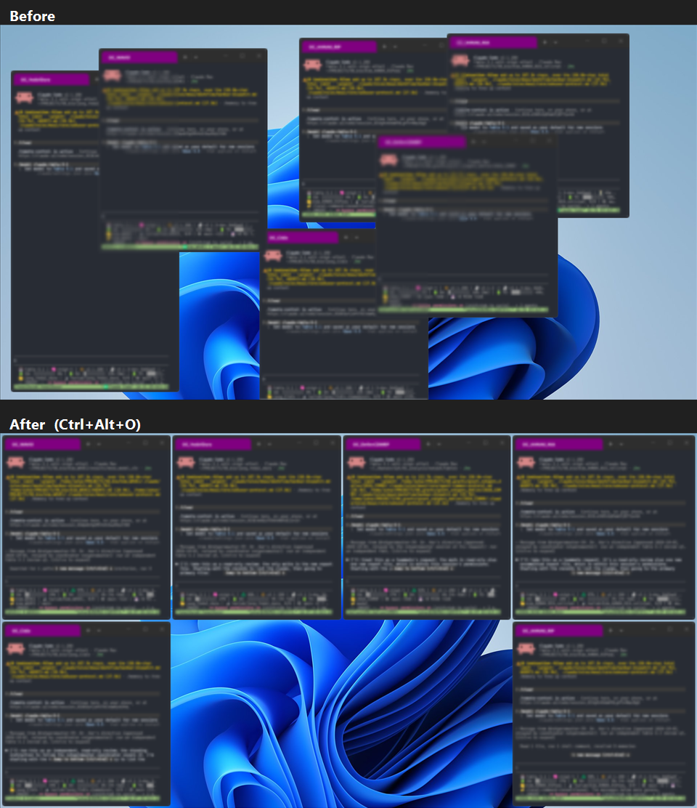

# TerminalOrganizer

A Windows tray app that organizes your Windows Terminal windows into the FancyZones layouts you already use — on demand, with one hotkey.

> Your FancyZones layouts, one hotkey away — for Windows Terminal.

Press `Ctrl+Alt+O`, and every Windows Terminal window on the monitor under your mouse cursor snaps into that monitor's FancyZones layout. That's the whole idea: you keep drawing layouts in FancyZones as usual, and TerminalOrganizer does the arranging.



*Terminal contents are blurred in this screenshot.*

## Requirements

- **Windows 10 or 11** — the app uses .NET Framework 4.8, which is preinstalled on both. Nothing extra to install.
- **PowerToys with FancyZones, and at least one layout applied to a monitor. This is a hard requirement.** TerminalOrganizer arranges windows into the layouts you already drew in FancyZones; it does not have its own layout editor. [PowerToys](https://github.com/microsoft/PowerToys) is free and published by Microsoft.
- **Windows Terminal** — the app organizes Windows Terminal windows specifically.

## Install

1. Download the zip from [Releases](../../releases) and extract it.
2. Keep **all three files together** in the extracted folder: `TerminalOrganizer.App.exe`, `TerminalOrganizer.Core.dll`, and `TerminalOrganizer.UiaProbe.exe`.
3. Double-click `TerminalOrganizer.App.exe`. There is no main window — the app lives in the tray, and its icon follows your Windows theme (light or dark).

The first run shows a small welcome dialog explaining the hotkey and the tray-overflow drag tip. It is shown once.

**SmartScreen:** the executable is unsigned, so the first run may show "Windows protected your PC". Click **More info** → **Run anyway**.

**Start with Windows (optional):** check **Start TerminalOrganizer with Windows** in the first-run dialog. If the app is already set up, press `Win+R`, type `shell:startup`, press Enter, and put a shortcut to `TerminalOrganizer.App.exe` in that folder. If you move the app folder later, update the shortcut's target. Windows Task Manager → **Startup apps** should show the shortcut enabled.

**Uninstall:** exit the app from the tray menu, then delete the folder. Settings are stored in `%LOCALAPPDATA%\TerminalOrganizer\settings.json` — delete that too for a fully clean removal.

## Usage

### The hotkey

`Ctrl+Alt+O` organizes the Windows Terminal windows on the monitor under the mouse cursor, using the FancyZones layout currently applied to that monitor.

### The tray menu

Right-click the tray icon:

| Menu item | What it does |
| --- | --- |
| **Organize monitor under cursor** | Same as the hotkey |
| **Organize a specific monitor** | Submenu lists your monitors with physical labels like `Left — 1920×1080` or `Right (Primary)` |
| **Manager** | Pin one window as the *manager* — it is protected and exempt from stacking. **Show** flashes it so you can find it; **Clear** unpins it |
| **Overflow behavior policy** | Choose what happens when windows don't all fit (see below) |
| **Labels and priorities** | Set labels by hand and see every window's rank and where it came from; ranks set by hand live in `priorityOverrides` in settings |
| **Last result** | Exact counts from the most recent organize |
| **Open log** / **Exit** | Open the log file / quit the app |

### Title rules: where each window's rank comes from

Every window gets an identity name and a rank from its tab titles. Priorities matter when windows overflow: **the lowest-priority windows are moved first** (a lower number means a higher priority).

The rules live in `%LOCALAPPDATA%\TerminalOrganizer\settings.json`, in the `titleRules` block. The tray menu has no rule editor; edit the file, and the next organize run, menu rebuild or tool run picks the change up without a restart. Rules are only read from a settings file with `"schemaVersion": 3`. A file that still says 2 (or an older number, or no version) gets its `titleRules` block ignored and replaced with the launcher-prefix default the next time the app saves, so check that the version is 3 before you add rules. The app writes 3 the first time it saves settings after the upgrade, for example after you choose a manager window.

```json
"titleRules": {
  "preset": "launcher-prefix",
  "defaultRank": 500,
  "rules": [
    { "match": "PowerShell*", "rank": 200 }
  ]
}
```

- `preset` is `"launcher-prefix"` or `"none"` (exactly, lowercase).
- `defaultRank` is a whole number from 0 to 999: the rank of a window that no rule and no session ranks. It defaults to 500.
- `rules` is an ordered list. The first rule that matches a tab decides that tab; later rules are not consulted. A rule that is malformed is skipped and written to the log once; the other rules still apply.

Five example rules:

1. Glob word: `{ "match": "PowerShell*", "rank": 200 }`. A pattern without `regex:` is a glob (`*` any run, `?` one character, case ignored) and must cover the whole title.
2. Single-letter regex: `{ "match": "regex:^[A-Z]:", "rank": 150 }`. Titles that start with a drive letter, such as `C:\work`.
3. Regex with name and rank captures: `{ "match": "regex:^(?<rank>[0-9]{1,3})-(?<name>.+)$" }`. The `name` capture becomes the identity name and the `rank` capture the rank.
4. Marker: `{ "marker": "#" }`. The title `~/proj #3 — zsh` means rank 3 and name `~/proj — zsh`.
5. Command-line match: `{ "match": "*--attach YODA*", "on": "commandline", "rank": 250 }`.

A rule may also set a fixed `name` and a fixed `rank`. The identity name comes from a `name` capture, else the rule's `name`, else the trimmed title.

**The `launcher-prefix` preset** is the old title grammar, kept as a built-in rule that is evaluated before your own rules: a leading token of a family letter from `O H N W`, a context letter from `C G D`, an optional single digit and `_`, then the session name. `HG2_YODA1` is the session `YODA1` with rank 2; `OC_EDITOR` is `EDITOR` with no rank. A settings file written by an earlier version has the preset switched on when it is upgraded, so nothing changes for existing users. A new install starts with `"preset": "none"`.

**Precedence.** A window's rank is the first of these that applies:

1. a rank you set by hand, as a `priorityOverrides` entry in settings.json;
2. the rank a title rule supplies (the preset first, then your rules in order);
3. the session class: Windows-native 100, local 300, remote 400; a window you labeled by hand counts as 300;
4. the default rank.

**Menu and tools.** Under **Labels and priorities**, every window is listed as `title (as identity) · rank N · where it came from`, for example `powershell · rank 200 · rule 1: PowerShell*`. Rows of windows that belong to a launcher session are for information only; the others keep the label action, which sets a label, not a rank. `tools\organize-dryrun.ps1` and `tools\organize-once.ps1 -WhatIf` print the same text, one `window:` line per window. Every window with a non-blank title can be chosen as the manager.

**Things to know**

- Identity follows the title, so a renamed window is a new identity. A manager or priority choice saved by identity keeps working while a rule still maps the new title to the same name; use a `name` capture or a fixed `name` when a title changes with the running command.
- Command-line rules apply only to launcher-session tabs: plain PowerShell, cmd and ssh windows have no command line to match.
- A settings file that is missing at upgrade, or that is reset after corruption, starts with the preset off.

If you prefer not to put priorities in titles, add `priorityOverrides` entries to settings.json, for example `"priorityOverrides": [ { "kind": "identity", "value": "YODA1", "rank": 120 } ]` (`kind` is `session`, `userlabel`, `rawtitle` or `identity`, case ignored; `rank` is 0 to 999). The tray menu does not set ranks; it shows each window's rank and where it came from.

### When windows don't all fit

When there are more windows than the layout has zones, the **Ask** dialog (the default policy) offers two options:

- **Stack only** — keep every window on this monitor; the extras stack instead of moving.
- **Move lowest-priority windows to free zones on other monitors** — cross-monitor redistribution, lowest priority first.

Check **Remember this choice** and the policy is saved — later overflows follow it without asking. You can change it at any time under **Overflow behavior policy** in the tray menu.

Cancelling the dialog moves nothing at all — cancellation performs zero mutations.

### Layouts follow virtual desktops

Layouts are read per current virtual desktop, per monitor, at every organize request. Switch to another desktop, apply a different FancyZones layout there, press `Ctrl+Alt+O` — that desktop's layout is the one used.

### Result counts

After every organize, the tray reports exact counts: **placed / unchanged / stacked / skipped / merged / failed**. The same numbers stay available under **Last result**.

### Session merge (advanced, off by default)

If you run duplicate tmux sessions, they can be merged into one window — but only through a supervised CLI drill: `tools\merge-test.ps1`. The drill requires explicit flags, verifies window identity before closing anything, and never force-kills processes. It is off by default; treat it as a power-user tool and read the script before running it.

The two supervised drills — run them only as a **manual verification** exercise, with disposable sessions:

```text
powershell -File tools\merge-test.ps1 -TargetHwnd <h> -SourceHwnd <h> -CommandLine "<verbatim from dump-windows>" -SessionName <name>
powershell -File tools\merge-test.ps1 -AttachOnly -TargetHwnd <h> -CommandLine "<verbatim from dump-windows>" -SessionName <name>
```

The first is the close drill (expects outcome `Merged`; the source closes only after identity inspection and the close-gate pass). The second is attach-only (launches and confirms the tab on the target window; the source path is never entered and nothing closes; expects outcome `Attached`).

## Safety design

TerminalOrganizer moves your windows around, so it is built to be conservative about it:

- **It never kills processes.** The only child process it ever terminates is its own read-only UI helper.
- **Windows are closed only via `WM_CLOSE`**, and only after verifying the window's identity.
- **Session merge is off by default** and release-gated.
- **A monitor topology change mid-operation aborts the run safely**, instead of misplacing windows.
- **Cancelling the overflow dialog mutates nothing** — zero window moves.
- **Single instance** — launching twice won't produce two apps fighting over your windows.

## CLI tools

Optional power-user scripts (PowerShell) in the `tools\` folder:

| Script | What it does |
| --- | --- |
| `tools\dump-monitors.ps1` | Print the monitor topology as the app sees it |
| `tools\dump-windows.ps1 -Monitor N` | List Windows Terminal windows on one monitor; `-AllMonitors` for all |
| `tools\organize-dryrun.ps1 -Monitor N` | Preview the placement plan — moves nothing |
| `tools\organize-once.ps1` | One headless organize run |
| `tools\merge-test.ps1` | Supervised session-merge drill (see above) |

## FAQ

**Windows shows "Windows protected your PC". Is something wrong?**
No — that is SmartScreen reacting to an unsigned executable. Click **More info** → **Run anyway**.

**Do I really need FancyZones?**
Yes. It is a hard requirement: TerminalOrganizer places windows into layouts you drew in FancyZones and has no layout editor of its own.

**Does it respect per-virtual-desktop layouts?**
Yes. The layout for the current virtual desktop is read fresh at every organize request.

**What does "merge" do?**
It merges duplicate tmux sessions into one window. It is advanced, off by default, and only reachable through the supervised `tools\merge-test.ps1` drill — it verifies window identity and never force-kills processes.

**Does it organize other applications' windows?**
No. It organizes Windows Terminal windows specifically.

**What happens if I cancel the overflow dialog?**
Nothing is moved. Cancellation performs zero mutations.

**Where are my settings stored?**
In `%LOCALAPPDATA%\TerminalOrganizer\settings.json`.

## Known limitations

- **Windows Terminal only.** Other terminals and other applications are not touched.
- **FancyZones is required and is the only layout source.** There is no layout editor; the app reads the layouts you applied in FancyZones (per monitor, per virtual desktop) at every run.
- **Verified at 100% display scaling only.** Canvas layouts follow FancyZones' DPI rules, but 125%/150% scaling has not been checked on a real screen yet. If a window lands a few pixels off on a scaled monitor, please open an issue with your scaling factor.
- **The executable is unsigned**, so SmartScreen warns on first run. Compare the download against the SHA-256 checksums attached to each release if you want to verify it.
- **One monitor per run.** The hotkey organizes the monitor under the cursor; the tray menu organizes the monitor you pick. Windows only move to other monitors through the overflow dialog's redistribute option.
- **Hotkey-driven, not automatic.** New terminal windows are not placed until you organize again.
- **Maximized or minimized windows are restored first; full-screen windows are skipped.**
- **Session merge is a supervised command-line drill**, not a menu action, and stays off unless you run it yourself.
- **Single instance.** A second copy exits immediately; the running one keeps the hotkey.
- **A window's identity follows the window title.** Rename a tab and the window is a new identity; a manager or priority choice saved by identity keeps applying only while a title rule still maps the new title to the same name.

## License

MIT — see [LICENSE](LICENSE). Copyright (c) 2026 Junguk Hur.

Layout geometry and file-format rules are reimplemented from
[Microsoft PowerToys](https://github.com/microsoft/PowerToys) FancyZones (MIT) —
see [THIRD-PARTY-NOTICES.md](THIRD-PARTY-NOTICES.md). Thanks, PowerToys!

---

## 한국어 빠른 시작

TerminalOrganizer는 Windows Terminal 창을 이미 쓰고 있는 FancyZones 레이아웃에 한 번에 정리해 주는 Windows 트레이 앱입니다. `Ctrl+Alt+O`를 누르면 마우스 커서가 있는 모니터의 Windows Terminal 창을 그 모니터에 적용된 레이아웃대로 배치합니다.

Windows 10/11, Windows Terminal, 그리고 레이아웃을 하나 이상 적용해 둔 PowerToys FancyZones가 필요합니다(위 Requirements 참고). Releases에서 zip을 내려받아 압축을 풀고 `TerminalOrganizer.App.exe`를 실행하면 트레이에 상주합니다.

창이 레이아웃보다 많으면 남는 창을 어떻게 처리할지 묻는 대화상자가 뜨는데, 취소하면 아무 창도 움직이지 않습니다.
